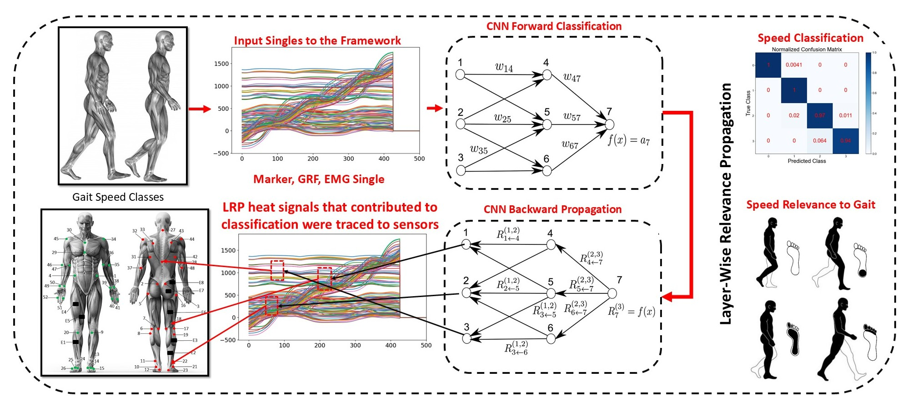

# Explainable-AI-for-Gait-Speed-Analysis-from-Mul-timodal-Data-Fusion
 
Gait speed analysis is vital for applications in healthcare, rehabilitation, human-robot interaction, and autonomous sys- 18 tems, necessitating robust methods to address its complexity. This study introduces an advanced framework for gait speed classifi- 19 cation through multimodal data fusion and deep learning, optimized using Layer-wise Relevance Propagation (LRP). Utilizing a 20 publicly available 4 datasets of 50 injury-free adults walking at varying speeds, we integrate data from full-body motion capture, 21 electromyography (EMG), and force plates to capture detailed gait dynamics. We propose two novel architectures: a hybrid Con- 22 volutional Neural Network with Long Short-Term Memory (CNN+LSTM) and a Multi-stream CNN, benchmarked against Tem- 23 poral Convolutional Networks (TCNs), Transformer neural networks, gated recurrent units (GRU) and statistical classifiers (e.g., 24 Linear Discriminant Analysis, Quadratic Discriminant Analysis, Support Vector Machines). All models in this study were trained, 25 validated and tested using three distinct strategies: experiment 1 (sample-based splitting – 10-fold cross-validation), experiment 2 26 (subject-based splitting – 5 subjects for testing), and experiment 3 (5-fold cross-validation, subject-based splitting – 10 subjects for 27 testing). Multi-stream Quads CNN is the best-performing model, achieving the highest F1 scores across all experiments (96.6% ± 28 1.4% experiment 1, 96.2% ± 1.6% experiment 2, 95.9% ± 0.9% experiment 3 with top performance for all experiments 98% ± 0.6%, 29 outperforming traditional approaches. LRP is applied to evaluate feature relevance within the model, enabling the removal of critical 30 features to verify robustness. Comprehensive assessments, including ROC curves, confusion matrices, t-test, and perturbation anal- 31 yses, validate the model’s enhanced performance and durability. By combining multimodal fusion to overcome single-sensor con- 32 straints with LRP-driven feature optimization, this work provides a highly accurate and resilient tool for gait analysis, with signifi- 33 cant potentials. 

 
	

